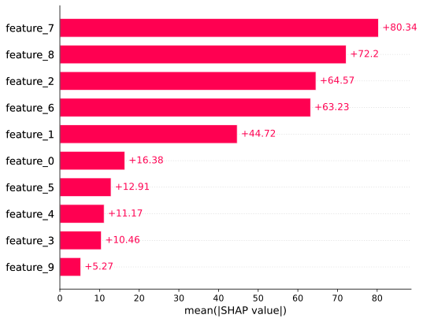
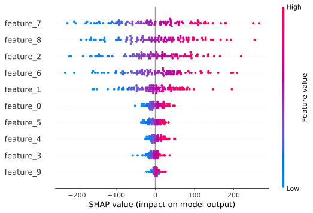
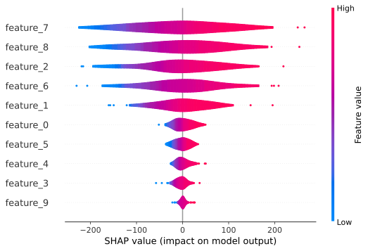
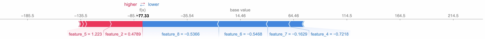
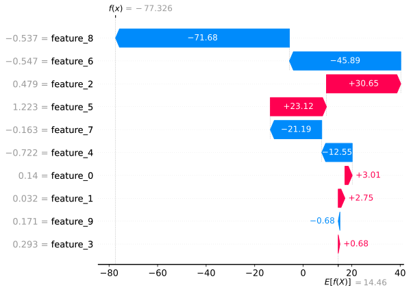
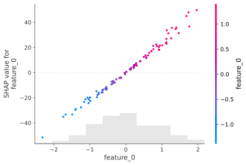

# Pytorch Model in Shap

An implemention of using PyTorch model in [shap](https://github.com/shap/shap) framework.

Created shap.Explanation object for PyTorch models to facilitate visualisation using a unified interface.

## Results

### Global Feature Contribution

**Bar Plot**:

The mean of absolute SHAP values represents the average impact of a feature on the prediction output of the model, considering the magnitude of the effect across all the instances in the dataset, regardless of the direction of that impact.

**Beeswarm Plot**:

Beeswarm plot illustrates the distribution and impact of individual features on a model's prediction, with each dot representing the SHAP value for a feature on an individual sample. Feature value can be inferred from the color.

**Violin Plot**:

Similar to beeswarm plot, but provides a richer, smoothed representation of the data distribution.

### Individual Prediction Explanation

Decomposet individual prediction to the baseline and each feature's contribution based on that. The baseline is the average prediction of the model over the explained dataset. It's the starting point for adding SHAP value for each feature. SHAP values represents the impact of a feature on the model's output. A high positive value increases the probability of a particular outcome, while a high negative value decreases it. 

- **Force Plot**:
Features pushing the prediction higher are displayed in red and those pushing the prediction lower in blue. The length and direction of each line indicate the magnitude and direction of the feature's impact.

 

- **Waterfall Plot**:
Waterfall plot displays the sequential contribution of individual variables to a particular prediction. Each bar represents the contribution of a feature to the change from a baseline (the average prediction) to the final prediction. Similar to force plot, red represents positive contributions and blue represents negative contributions.

### Conditional Feature Importance

Conditional feature importance helps to understand the interaction betwen features and how one feature's value affects the imortance of another.

- **Scatter Plot**:
The scatter plot shows the relationship between the SHAP values for one feature and the values of another feature, essentially highlighting how changes in the one feature value impact the contribution of another feature.

